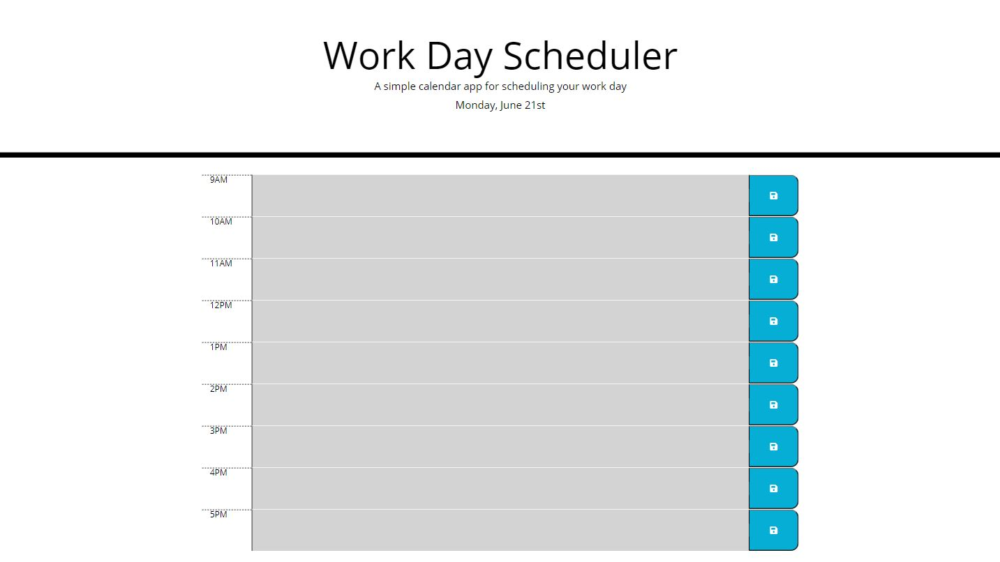
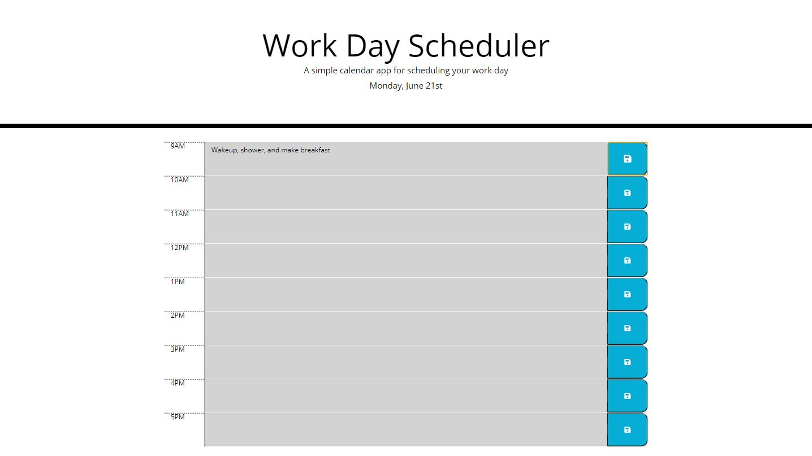

# Work-Day-Planner

This is a workday planner that allows the user to block out their work day (9AM-5PM) by the hour with what they would like to do. There is a save feature where they can click the button on the right hand side to save any text contents that they entered into the textarea into local storage. Upon reloading the page, if the user clicked the save button with there being text in the textarea, the text should still be in that block. Alongside this, during the work day, the hour blocks will change color depending on the time of day. If the hour has already passed, it is a gray color. If it is the present hour, it is red. If it is in the future, it is highlighted green.

**Above is an image of the base webpage upon load with no colors as the work day is over**

 

**Above is an image of the webpage with text entered and saved in the 9AM hour block.**

Link to deployed webpage: https://zacharyjg00.github.io/Work-Day-Planner/